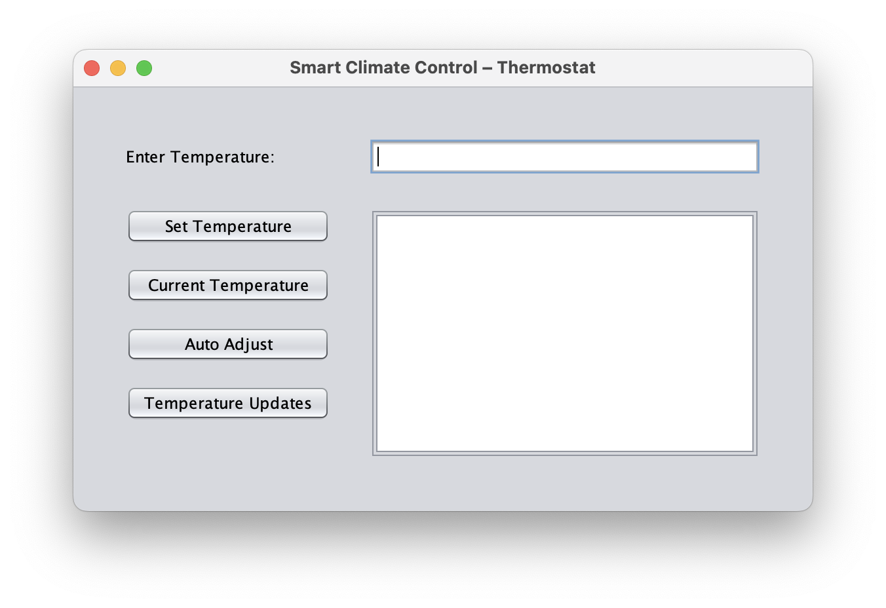
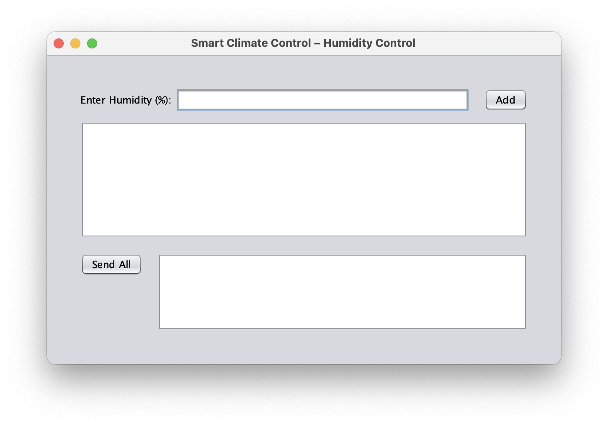
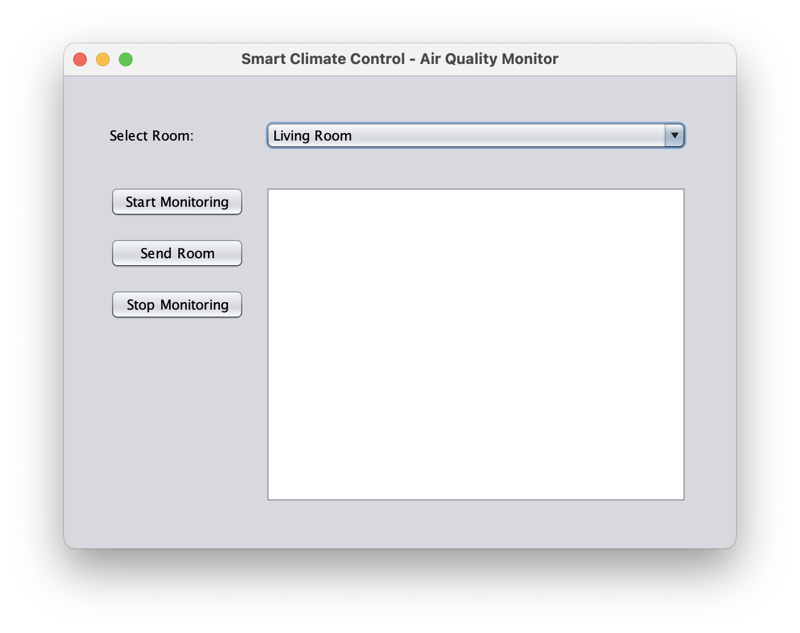

# 🌡️ Smart Climate Control System

A simulated smart home system developed in **Java** using **gRPC**, consisting of 3 core services: **Thermostat**, **Humidity Controller**, and **Air Quality Monitor**. Each service demonstrates a different gRPC communication style and mimics real-world smart home automation scenarios.

---

## 🛠️ Built With

- **Java**
- **gRPC**
- **NetBeans IDE**
- **Swing (Java GUI)**
- **Protocol Buffers (proto3)**

---

## ⚙️ Features

| Service              | gRPC Style             | Description                                                                 |
|----------------------|------------------------|-----------------------------------------------------------------------------|
| **Thermostat**       | Unary + Server Stream  | Set/Get temperature, toggle auto-adjust mode, stream periodic updates.     |
| **Humidity Control** | Client Streaming       | Send multiple humidity readings and receive a summary response.            |
| **Air Quality Monitor** | Bi-Directional Stream | Live monitoring: send room names and receive ongoing air quality alerts.    |

---

## 📁 Project Structure

```
smart-climate-control-system/
├── thermostat/
│   ├── ThermostatServer.java
│   ├── ThermostatServiceImpl.java
│   ├── ThermostatGUI.java
├── humidity/
│   ├── HumidityServer.java
│   ├── HumidityServiceImpl.java
│   ├── HumidityGUI.java
├── airquality/
│   ├── AirQualityServer.java
│   ├── AirQualityServiceImpl.java
│   ├── AirQualityGUI.java
├── protos/
│   ├── Thermostat.proto
│   ├── HumidityControl.proto
│   └── AirQualityMonitor.proto
```

---

## 🧪 How to Run

1. **Clone the repo**  
   ```bash
   git clone https://github.com/your-username/smart-climate-control-system.git
   ```

2. **Open in NetBeans**

3. **Generate gRPC code from .proto files** (if needed using `protoc`)

4. **Start Servers:**
   - Run `ThermostatServer.java`
   - Run `HumidityServer.java`
   - Run `AirQualityServer.java`

5. **Launch GUIs:**
   - Run `ThermostatGUI.java`
   - Run `HumidityGUI.java`
   - Run `AirQualityGUI.java`

---

## 🔐 Security Features

- Basic error handling with user-friendly GUI messages
- Clear feedback when services are unavailable

---

## 📸 Screenshots

| Thermostat GUI | Humidity GUI | Air Quality GUI |
|----------------|--------------|------------------|
|  |  |  |

---

## 📚 Report & Demo

- 📄 [Project Report (PDF)](link-to-report)
- 🎥 [Video Demo (YouTube)](link-to-video)

---

## 🔗 Links

- [gRPC Java Documentation](https://grpc.io/docs/languages/java/)
- [Protocol Buffers](https://developers.google.com/protocol-buffers)

---

## 👤 Author

**Guilherme Silveira**  
📧 gws.silveira@gmail.com  
🌍 Dublin, Ireland
